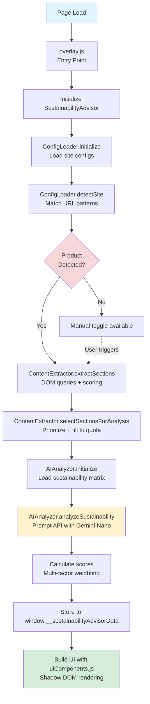
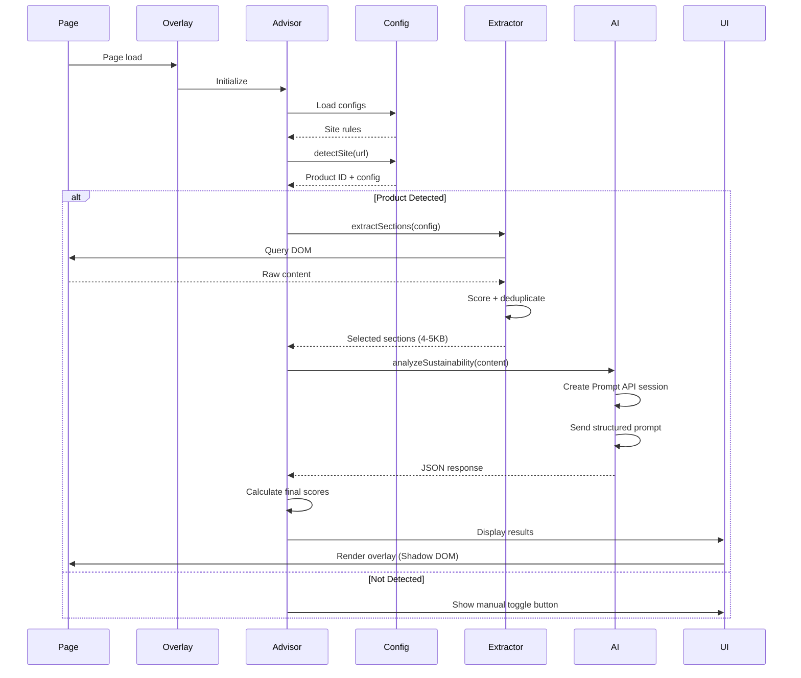

<div align="center">
  
  
  # Envairo
  ### AI-Powered Sustainability Advisor for E-Commerce
  
  **Chrome Built-in AI Challenge 2025**
  
  
  
  
  
</div>

---

## Overview

Envairo analyzes e-commerce products in real-time to provide science-backed sustainability scores. Built entirely on Chrome's Built-in AI APIs (Prompt API with Gemini Nano), all analysis happens on-device with zero external API calls or data transmission.

**Core Problem:** Consumers face information asymmetry when shopping online. Product pages bury material composition in dense text, environmental claims often amount to greenwashing, and comparing sustainability across products is nearly impossible.

**Solution:** Automated extraction and analysis of product information using on-device AI, scored against a database of 200+ materials with research-backed environmental impact data.

### Key Features

- **Automatic Analysis:** Detects product pages and analyzes in 5-15 seconds
- **Material Intelligence:** Extracts composition with percentage breakdowns
- **Certification Detection:** Recognizes GOTS, OEKO-TEX, Climate Pledge Friendly, and 20+ certifications
- **Transparent Scoring:** Multi-factor scores (0-100) with detailed breakdowns
- **Privacy-First:** 100% on-device processing via Gemini Nano
- **Extensible:** Add new sites via JSON configs in 20-30 minutes

### Supported Sites

- Amazon (all domains: .com, .co.uk, .de, .fr, .ca, .in, .it, .es, .com.au, .co.jp)
- Walmart (walmart.com)

---

## Quick Start

### Prerequisites

1. **Chrome Canary** (version 128.0.6545.0+) - [Download](https://www.google.com/chrome/canary/)
2. **22 GB storage** for Gemini Nano model
3. **4GB+ GPU** recommended

### Setup (5 minutes)

**1. Enable AI Flags**

```
chrome://flags/#prompt-api-for-gemini-nano → Enabled
chrome://flags/#summarization-api-for-gemini-nano → Enabled
```

Relaunch Chrome Canary.

**2. Download Gemini Nano**

Open DevTools (F12), then in Console:

```javascript
await ai.languageModel.create();
```

Navigate to `chrome://components`, find "Optimization Guide On Device Model", click "Check for update". Download takes 10-30 minutes (~22 GB).

**3. Install Extension**

```
1. Clone/download repository
2. Open chrome://extensions/
3. Enable "Developer mode"
4. Click "Load unpacked"
5. Select the extension folder
```

**4. Verify**

In DevTools Console:

```javascript
await ai.languageModel.availability();  // Should return "readily"
```

---

## Architecture

### Design Philosophy

Envairo uses a **configuration-driven, modular architecture** that separates logic from data. This design choice came from the realization that hardcoding extraction rules for each site would create unmaintainable spaghetti code.

**Benefits:**
- New sites: 20-30 minutes vs. 4-8 hours
- Non-developers can contribute site configs
- Updates via JSON, no code changes
- Easy to test with mocked configs

### System Diagram



### Core Modules

**ConfigLoader** (`src/core/ConfigLoader.js`)
- Loads JSON configs from `src/config/sites/`
- Matches URLs against regex patterns
- Returns site-specific extraction rules

**ContentExtractor** (`src/core/ContentExtractor.js`)
- Applies selectors from configs
- Scores sections by sustainability relevance
- Deduplicates overlapping content
- Reduces 50-200KB pages to 4-5KB of focused content

**AIAnalyzer** (`src/core/AIAnalyzer.js`)
- Wraps Chrome Prompt API
- Loads sustainability matrix (200+ materials)
- Structures prompts for consistent JSON output
- Parses and validates AI responses

**SustainabilityAdvisor** (`src/core/SustainabilityAdvisor.js`)
- Orchestrates the complete pipeline
- Manages state and error handling
- Triggers UI updates

### Data Flow



### Technology Stack

**Chrome Built-in AI**
- Prompt API (Gemini Nano) for structured extraction
- Summarizer API for content analysis (alternative approach)

**Architecture Patterns**
- ES6 modules with dynamic imports
- Shadow DOM for CSS isolation
- Configuration-driven design
- Observer pattern for URL changes

**Performance**
- Lazy loading of modules
- Single-pass content extraction
- Hash map lookups for material scores
- Hardware-accelerated CSS animations

---

## Chrome AI Integration

### Prompt API Usage

The core of Envairo's analysis uses Chrome's Prompt API with carefully structured prompts.

**Session Creation:**

```javascript
const session = await ai.languageModel.create({
  temperature: 0.1,  // Low for consistency
  topK: 3            // Focused output
});
```

**Prompt Structure:**

The prompt engineering was critical to getting consistent, accurate results. Key components:

1. **Role Definition:** "You are a sustainability analyst..."
2. **Task Specification:** Extract structured data in JSON format
3. **Input Content:** ~4KB of relevant product text
4. **Reference Data:** CSV of material scores
5. **Output Schema:** Strict JSON structure with examples
6. **Validation Rules:** Percentage normalization, material validation
7. **Style Guide:** Conversational, specific, actionable advice

**Example Prompt Flow:**

```
System Context:
  - Role: Sustainability analyst
  - Task: Extract materials, certifications, features
  - Output: Strict JSON format

Input Data:
  - Product content (4KB)
  - Sustainability matrix (200+ materials)

Instructions:
  - Extract ONLY mentioned materials
  - Normalize percentages to 0-1 range
  - Detect certifications (GOTS, OEKO-TEX, etc.)
  - Identify durability features
  - Provide recommendation

Examples:
  - Correct: {"materials": [{"name": "Cotton", "percentage": 0.92, ...}]}
  - Incorrect: {"materials": [{"name": "Button", ...}]}  // Not a material!
```

**Response Parsing:**

```javascript
// Extract JSON from markdown code blocks
const jsonMatch = response.match(/```json\n([\s\S]*?)\n```/);
const parsed = JSON.parse(jsonMatch[1]);

// Validate structure
if (!parsed.materials || !Array.isArray(parsed.materials)) {
  throw new Error('Invalid response structure');
}

// Normalize percentages (handles both 0-1 and 0-100 formats)
parsed.materials.forEach(material => {
  if (material.percentage > 1) {
    material.percentage = material.percentage / 100;
  }
});
```

### Content Extraction Strategy

Amazon product pages contain 50-200KB of HTML. Gemini Nano has input quotas, so we needed intelligent extraction.

**Two-Tier Approach:**

**Tier 1: Always Include** (structure-based)
- Product title
- Technical specifications
- Product facts (fabric, care)
- Climate Pledge sections
- Certification badges

**Tier 2: Conditional Include** (keyword-filtered)
- Detail bullets (mixed content)
- Product descriptions
- A+ content sections

**Scoring System:**

Each section gets a base score, then bonuses for:
- Material indicator patterns (`made of`, `% cotton`)
- Sustainability keywords
- Certification mentions

```javascript
{
  "#productTitle": 0.90,              // Always critical
  "#productFactsDesktop": 0.85,       // High priority
  "#feature-bullets": 0.75,           // Medium (if relevant)
  "#productDescription": 0.70         // Lower (if relevant)
}

// Pattern bonuses
patterns: [
  { pattern: "made (of|from|with)", bonus: 0.10 },
  { pattern: "\\d+%\\s+[\\w\\-]+", bonus: 0.10 },  // "50% cotton"
  { pattern: "certified (by|to)", bonus: 0.10 }
]
```

**Selection Algorithm:**

1. Always include critical sections
2. Sort conditional sections by score
3. Add sections until ~85% of AI input quota
4. Result: 4-5KB of highly relevant content

This approach reduced analysis time by 70% (from 30+ seconds to 5-15 seconds).

---

## Sustainability Scoring

### Methodology

Envairo uses a **hybrid AI + science approach**:

1. **Research-backed data:** Material GHG scores from credible databases
2. **AI-powered context:** Certifications, durability, packaging analysis
3. **Transparent calculation:** All components visible to users

### Score Formula

```
Final Score = Base Material Score + Bonuses - Penalties
(Capped at 0-100)
```

### Components

**1. Base Material Score (60-80% weight)**

Weighted average of material composition:

```
Material Score = Σ (material_percentage × reference_score)
```

Example:
- Product: 92% Organic Cotton, 8% Elastane
- Calculation: (0.92 × 97.6) + (0.08 × 87.3) = 96.6

**Material Database (200+ entries):**
- **ICE v3.0:** Inventory of Carbon & Energy database
- **PlasticsEurope:** Eco-profiles for polymers
- **USLCI:** US Life Cycle Inventory database
- **OWID:** Our World in Data (food products)

Sample entries:

| Material | GWP (kgCO2e) | Recyclable | Biodegradable | Score |
|----------|--------------|------------|---------------|-------|
| Cotton (Organic) | 1.8 | Partial | Yes | 95.9 |
| Polyester (Recycled) | 3.0 | Yes | No | 78.4 |
| Polyester (Virgin) | 7.1 | Yes | No | 42.3 |
| PVC | 2.5 | Limited | No | 28.7 |

**2. Certification Bonus (up to +15)**

| Certification | Points | Description |
|--------------|--------|-------------|
| GOTS | +10 | Global Organic Textile Standard |
| Cradle to Cradle | +8 | Circular design principles |
| OEKO-TEX 100 | +8 | Harmful substance testing |
| Fair Trade | +7 | Worker welfare + sustainability |
| Climate Pledge Friendly | +5 | Carbon reduction commitment |
| GRS | +5 | Global Recycled Standard |
| Energy Star | +3 | Energy efficiency |

**3. Durability Bonus (up to +10)**

| Feature | Points |
|---------|--------|
| Lifetime warranty | +10 |
| Warranty >5 years | +8 |
| Rechargeable | +8 |
| Reusable | +8 |
| Refillable | +6 |
| Warranty 2-5 years | +5 |
| Replaceable parts | +4 |

**4. Packaging Bonus (up to +5)**

| Feature | Points |
|---------|--------|
| Plastic-free | +5 |
| Compostable | +4 |
| Recyclable cardboard | +3 |
| Minimal packaging | +2 |

**5. Circularity Penalty (up to -10)**

| Issue | Penalty |
|-------|---------|
| Non-recyclable major material | -5 |
| Single-use product | -5 |
| Hazardous substances | -3 |
| Non-recyclable composite | -3 |

### Tier System

- **A+ (90-100):** Exceptional environmental performance
- **A (80-89):** Excellent choice
- **B (70-79):** Good option
- **C (60-69):** Fair, room for improvement
- **D (0-59):** Poor, significant impact

### Example Calculation

**Organic Cotton T-Shirt:**

```
Materials:
  95% Organic Cotton (97.6) = 92.7
  5% Elastane (87.3) = 4.4
  Base Score: 97.1

Bonuses:
  GOTS certification: +10
  OEKO-TEX: +8
  (Capped at +15)
  
  Machine washable: +5
  Recyclable packaging: +3

Penalties:
  Elastane not recyclable: -2

Final: 97.1 + 15 + 5 + 3 - 2 = 118.1 → 100 (capped)
Tier: A+
```

### Data Limitations

**What these scores represent:**
- Screening-level GHG estimates (not product-specific LCAs)
- Cradle-to-gate scope (excludes use and disposal)
- Regional variance exists

**Use for:**
- Relative comparisons between similar products
- Understanding material trade-offs
- Identifying certified products

**Do not use for:**
- Absolute environmental claims
- Carbon footprint accounting
- Regulatory compliance

---

## Configuration System

### Adding New Sites

The configuration-driven architecture makes site addition straightforward.

**Step 1: Create Config**

`src/config/sites/target.json`:

```json
{
  "id": "target-us",
  "name": "Target",
  "version": "1.0.0",
  "enabled": true,
  "detection": {
    "urlPatterns": [{
      "pattern": "https://www.target.com/p/.*/-/A-(\\d+)",
      "productIdGroup": 1
    }]
  },
  "extraction": {
    "selectors": {
      "alwaysInclude": [
        {
          "selector": "[data-test='product-title']",
          "label": "Product Title",
          "baseScore": 0.90,
          "priority": "critical"
        },
        {
          "selector": "[data-test='item-details']",
          "label": "Product Details",
          "baseScore": 0.85,
          "priority": "critical"
        }
      ],
      "conditionalInclude": [
        {
          "selector": "[data-test='product-description']",
          "label": "Description",
          "baseScore": 0.70,
          "requiresKeywords": true
        }
      ]
    },
    "keywords": {
      "materials": [
        "cotton", "polyester", "nylon", "wool",
        "recycled", "organic", "plastic", "metal"
      ],
      "sustainability": [
        "sustainable", "eco-friendly", "organic",
        "recycled", "biodegradable", "renewable"
      ]
    },
    "patterns": [
      { "pattern": "made (of|from|with)", "bonus": 0.10 },
      { "pattern": "\\d+%\\s+[\\w\\-]+", "bonus": 0.10 },
      { "pattern": "certified (by|to)", "bonus": 0.10 }
    ]
  }
}
```

**Step 2: Register Config**

`src/core/ConfigLoader.js`:

```javascript
const siteConfigs = [
  'amazon.json',
  'walmart.json',
  'target.json'  // Add this
];
```

**Step 3: Test**

1. Reload extension
2. Visit product page
3. Check console for logs
4. Verify extraction and analysis

**Time Required:** 20-30 minutes (with HTML analysis)

### Config Schema

**Detection Block:**
- `urlPatterns`: Regex patterns for URL matching
- `productIdGroup`: Capture group index for product ID
- `domSignals`: Fallback verification selectors

**Extraction Block:**
- `selectors`: DOM query selectors with scores
- `keywords`: Sustainability-related terms
- `patterns`: Regex patterns for material indicators

**Analysis Block:**
- `summarizer`: Summarizer API configuration (alternative to Prompt API)

---

## UI Design

### Visual System

Envairo uses an iOS-inspired **glass morphism design** with neutral aesthetics.

**Core Effect:**

```css
background: rgba(255,255,255,0.18);
backdrop-filter: blur(24px) saturate(180%);
border: 1px solid rgba(255,255,255,0.5);
border-radius: 22px;
box-shadow: 0 22px 60px rgba(0,0,0,0.22);
```

**Color Palette:**

```css
/* Neutral base */
--glass-bg: rgba(255,255,255,0.18);
--text-strong: #0b0f13;
--text-weak: rgba(11,15,19,0.64);

/* Accent colors */
--accent-blue: rgba(60,130,255,0.55);
--accent-green: rgba(46,184,76,0.50);
--accent-red: rgba(255,59,48,0.5);
```

### Component Library

Built-in components (`src/utils/uiComponents.js`):

- `createLoadingState()` - Shimmer skeleton
- `createScoreRing()` - SVG circular progress
- `createBreakdownCard()` - Score component breakdown
- `createMaterialsCard()` - Material composition
- `createCertificationsCard()` - Badge grid
- `createInsightsCard()` - Strengths and concerns
- `createRecommendationCard()` - AI-generated advice
- `createErrorState()` - Error handling UI

### Icon System

15+ inline SVG icons (`src/utils/icons.js`):
- Core: leaf, check, alert, sparkles, target
- Data: barChart, trophy, clock, box, recycle
- UI: lightbulb, fabric, shield, close, spinner

No external dependencies, SF Symbols inspired.

### Shadow DOM

```javascript
const host = document.createElement('div');
host.id = 'sustainability-overlay-host';
const shadow = host.attachShadow({mode: 'open'});

// Isolated CSS
const link = document.createElement('link');
link.href = chrome.runtime.getURL('src/overlay.css');
shadow.appendChild(link);
```

**Benefits:**
- No CSS conflicts with host page
- Clean encapsulation
- Secure styling

---

## Performance

### Benchmarks

| Phase | Duration | Notes |
|-------|----------|-------|
| Config Loading | ~5ms | One-time on init |
| Product Detection | ~1ms | URL pattern match |
| Content Extraction | 50-100ms | DOM queries + scoring |
| AI Analysis | 5-15s | First run: 15-30s (model init) |
| UI Rendering | <100ms | Shadow DOM + animations |
| **Total** | **5-15s** | User-facing metric |

### Optimizations

**1. Targeted Extraction**

Before: Process 50-200KB → Multiple AI calls → 15-30s  
After: Extract 4-5KB → Single AI call → 5-15s  
**Improvement:** 70% faster

**2. Efficient Scoring**

- CSV loaded once on init (cached)
- Hash map lookups for material scores: O(1)
- Vectorized calculations

**3. Lazy Loading**

```javascript
const {sustainabilityAdvisor} = await import(
  chrome.runtime.getURL('src/core/SustainabilityAdvisor.js')
);
```

Load modules only when needed.

**4. Hardware Acceleration**

```css
.overlay {
  will-change: transform;
  transform: translateZ(0);
}
```

GPU-accelerated animations for smooth 60fps.

**5. Deduplication**

Algorithm removes overlapping content:
- O(n) signature generation
- O(n²) overlap checking with early exits
- 95% reduction in duplicate processing

---

## File Structure

```
src/
├── core/                          # Core logic (ES6 modules)
│   ├── AIAnalyzer.js              # Prompt API integration
│   ├── ConfigLoader.js            # Site configuration management
│   ├── ContentExtractor.js        # Intelligent extraction engine
│   └── SustainabilityAdvisor.js   # Pipeline orchestrator
│
├── config/                        # Site configurations (JSON)
│   ├── schema.json                # Config validation schema
│   └── sites/
│       ├── amazon.json            # Amazon extraction rules
│       └── walmart.json           # Walmart extraction rules
│
├── data/                          # Environmental data
│   └── sustainability_matrix.csv  # 200+ materials with GHG scores
│
├── utils/                         # Utility modules
│   ├── csvLoader.js               # CSV parsing
│   ├── icons.js                   # SVG icon library (15+ icons)
│   └── uiComponents.js            # UI component builders
│
├── overlay.js                     # Content script entry point
├── overlay.css                    # Glass morphism styles
├── bg.js                          # Background service worker
├── popup.html                     # Extension popup UI
├── popup.js                       # Popup logic
│
└── icons/                         # Extension icons
    ├── icon-16.png
    ├── icon-48.png
    ├── icon-128.png
    └── logo.png
```

---

## Development

### Local Setup

```bash
git clone <repository-url>
cd chrome-built-in
```

Load extension in Chrome Canary (see Quick Start).

### Hot Reload

- **Content scripts:** Reload extension + hard refresh page (Cmd+Shift+R)
- **Background worker:** Reload extension only
- **Popup:** Close and reopen
- **CSS:** Hard refresh page

### Testing

**Console Output:**

```
[AI Glass Overlay] Content script loaded
[SustainabilityAdvisor] Initializing...
[ConfigLoader] Loaded 2 site configuration(s)
[SustainabilityAdvisor] ✅ Product detected: Amazon (Global)
[ContentExtractor] Extracted 12 unique sections
[AIAnalyzer] Prompt API ready
[AIAnalyzer] 🤖 Prompting model...
[AIAnalyzer] ✅ Response received in 8.42s
[SustainabilityAdvisor] 🌱 SUSTAINABILITY SCORE: 78/100 (B)
[SustainabilityAdvisor] 🎉 Complete! Total time: 8.50s
```

**Accessing Data:**

```javascript
// In DevTools console
window.__sustainabilityAdvisorData

// Returns complete analysis:
// - materials, certifications, strengths, concerns
// - score breakdown, timing data
```

### Debugging

**Check Product Detection:**

```javascript
window._isProductPage  // Should be true on product pages
```

**Verify AI Availability:**

```javascript
await ai.languageModel.availability()  // Should return "readily"
```

**Check Overlay Exists:**

```javascript
document.getElementById('sustainability-overlay-host')
```

---

## Troubleshooting

### AI Not Available

**Symptom:** Console shows "LanguageModel API not available"

**Solutions:**
1. Verify flags enabled at `chrome://flags`
2. **Relaunch Chrome** (critical)
3. Run: `await ai.languageModel.create()`
4. Check `chrome://components` for model status

### Model Downloading

**Symptom:** Availability returns `"after-download"`

**Solutions:**
1. Navigate to `chrome://components`
2. Find "Optimization Guide On Device Model"
3. Wait for completion (10-30 minutes, ~22 GB)
4. **Relaunch Chrome**

### Overlay Not Appearing

**Debug Steps:**

```javascript
// Check product detection
window._isProductPage

// Check overlay exists
document.getElementById('sustainability-overlay-host')

// Check for errors
// Look in console for red errors
```

**Solutions:**
1. Ensure you're on a product page (not search/homepage)
2. Check console for errors (F12)
3. Reload extension at `chrome://extensions/`
4. Hard refresh page

### Slow Performance

**Expected:**
- First run: 15-30 seconds (model initialization)
- Subsequent: 5-15 seconds

**Check timing breakdown:**

```javascript
const data = window.__sustainabilityAdvisorData;
console.log('Extraction:', data.extractionTime, 's');
console.log('Analysis:', data.analysisTime, 's');
console.log('Total:', data.totalTime, 's');
```

---

## Technical Decisions

### Why Configuration-Driven?

**Problem:** Hardcoded extraction logic became unmaintainable at ~1,200 lines.

**Solution:** Separate data (JSON configs) from logic (ES6 modules).

**Results:**
- Code reduction: 1,188 → 427 lines (64%)
- New site time: 4-8 hours → 20-30 minutes
- Non-developers can contribute configs

### Why Shadow DOM?

**Problem:** CSS conflicts with host page styles.

**Solution:** Encapsulate overlay in Shadow DOM.

**Results:**
- Complete style isolation
- No interference with page layout
- Secure encapsulation

### Why Prompt API over Summarizer API?

**Testing:** Both APIs were evaluated.

**Prompt API advantages:**
- Structured JSON output
- Better control over format
- More consistent results
- Can embed reference data (sustainability matrix)

**Summarizer API limitations:**
- Free-form text output
- Less structured
- Required additional parsing

**Decision:** Prompt API for production, Summarizer API configs retained for experimentation.

### Why Single AI Call?

**Alternative:** Multiple AI calls (extract materials, then certifications, then score).

**Problem:** Each call adds 5-15 seconds.

**Solution:** Single comprehensive prompt with structured JSON output.

**Results:**
- 70% faster (5-15s vs 15-45s)
- More context for AI
- Consistent analysis

---

## Version History

### v1.0.5 (Current)

**Added:**
- Complete glass morphism overlay UI
- Animated circular score ring
- Material visualization, certification badges
- AI-generated recommendations
- Draggable overlay positioning
- Keyboard shortcuts (Cmd+Shift+Y)
- Icon library (15+ inline SVGs)

**Fixed:**
- Material hallucination bug (AI inventing materials)
- Percentage format issues (10000% → 100%)
- Auto-display on non-product pages

### v1.0.4

**Added:**
- Sustainability scoring with 200+ material database
- Structured data extraction via Prompt API
- Multi-factor scoring system
- Certification detection

### v1.0.2

**Architecture Overhaul:**
- Configuration-driven system
- JSON-based site configs
- Core module separation
- 64% code reduction

### v1.0.1

**Added:**
- Intelligent content extraction
- Two-tier scoring system
- Pattern matching for materials
- Deduplication algorithm

### v1.0.0

**Initial Release:**
- Chrome Prompt API integration
- Manifest V3 structure
- Extension popup UI
- Glass morphism design

---

## Contributing

### How to Contribute

1. **Report Bugs:** File issues with product URL, console logs, reproduction steps
2. **Add Site Configs:** Contribute JSON configs for new sites (20-30 min each)
3. **Improve Docs:** Fix typos, add examples, clarify instructions
4. **Code Improvements:** Submit PRs for bug fixes or enhancements

### Code Style

- Modern ES6+ JavaScript
- Async/await over promise chains
- Template literals for strings
- Destructuring for objects
- JSDoc comments for functions

---

## Resources

**Official Documentation:**
- Chrome AI Challenge: https://googlechromeai2025.devpost.com/
- Prompt API: https://developer.chrome.com/docs/ai/prompt-api
- Summarizer API: https://developer.chrome.com/docs/ai/summarizer-api
- Manifest V3: https://developer.chrome.com/docs/extensions/mv3/

**Data Sources:**
- ICE v3.0: Inventory of Carbon & Energy database
- PlasticsEurope: Eco-profiles for polymers
- USLCI: US Life Cycle Inventory database
- OWID: Our World in Data (environmental impacts)

---

## License

Open source for educational and hackathon purposes.

**Built for:** Google Chrome Built-in AI Challenge 2025

---

**Version:** 1.0.5  
**Status:** Production-Ready  
**Last Updated:** October 20, 2025

Built with Chrome's Built-in AI APIs (Gemini Nano)

